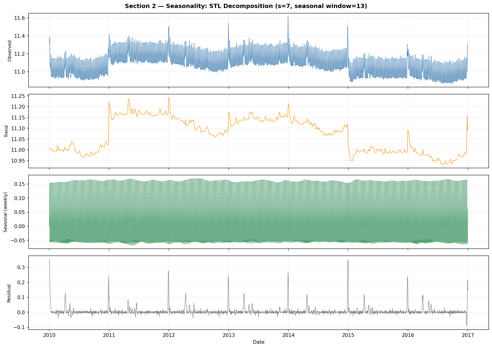
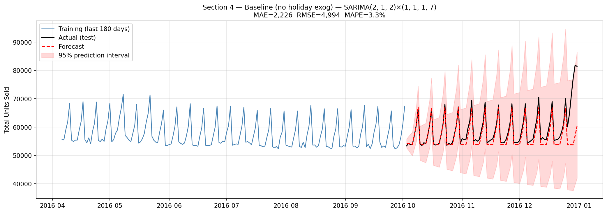
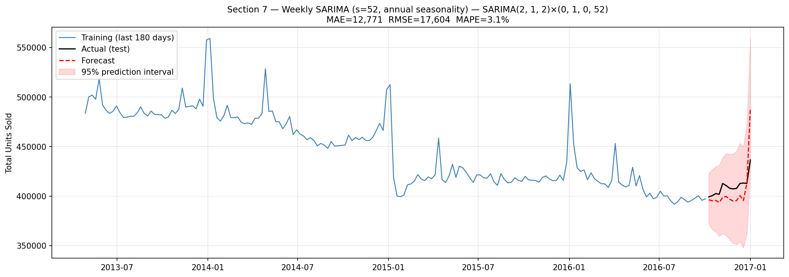

# Forecasting Sticker Sales — SARIMA Approach

[Kaggle Playground Series S5E1](https://www.kaggle.com/competitions/playground-series-s5e1) · January 2025

Forecast daily sticker sales for 2017–2019 across 90 time series (5 products × 6 countries × 3 stores). Evaluated on **MAPE**.

---

## Approach

A classical SARIMA methodology, documented step by step in [`SARIMA_process.txt`](SARIMA_process.txt). Rather than a single model fit, the workflow builds understanding incrementally — stationarity testing, seasonality detection, ACF/PACF reading — before arriving at a model through grid search.

STL decomposition reveals a stable weekly seasonal component (green) and a rising long-term trend (orange), with isolated spikes in the residual panel pointing to holiday and annual-cycle events the weekly model cannot absorb.



Two complementary models address distinct seasonal structures in the data:

| Model | Seasonal period | Captures |
|---|---|---|
| SARIMA(2,1,2)(1,1,1)[7] | s = 7 | Weekly demand cycle |
| SARIMA(2,1,2)(0,1,0,52] | s = 52 | Annual demand cycle (weekly aggregation) |

A SARIMAX extension adds a binary public holiday indicator (across all four countries in the dataset) as an exogenous regressor to absorb demand spikes that the ARIMA structure cannot model.

---

## Results

Evaluated on a held-out test window (last 90 days of training data for the daily model; last 13 weeks for the weekly model).

| Model | MAE | RMSE | MAPE |
|---|---|---|---|
| Daily SARIMA — baseline | 2,226 | 4,994 | 3.35% |
| Daily SARIMA + holiday exog | — | — | — |
| Weekly SARIMA (s=52) | 12,771 | 17,603 | 3.06% |

**Daily model** — 90-day out-of-sample forecast. The weekly cycle is tracked well; the widening prediction interval toward year-end reflects compounding uncertainty over a 90-step horizon.



**Weekly model** — 13-week out-of-sample forecast. The annual-scale peaks (e.g., end-of-year spikes visible in the training window) are captured by the s=52 seasonal structure, explaining the MAPE improvement from 3.35% to 3.06%.



The weekly model's lower MAPE confirms that annual seasonality is a meaningful error source in the daily model. Its RMSE/MAE ratio of 1.38× vs 2.2× for the daily model indicates the large residual spikes in the daily model are partially explained by annual-scale events that the weekly model captures directly.

> MAE and RMSE for the weekly model are in weekly units (~7× daily volume); use MAPE for cross-model comparison.

---

## Dataset

| Field | Detail |
|---|---|
| Training period | 2010-01-01 to 2016-12-31 |
| Forecast period | 2017-01-01 to 2019-12-31 |
| Series | 90 (5 products × 6 countries × 3 stores) |
| Granularity | Daily |
| Target | `num_sold` |
| Missing values | ~3.85% in training set |

The workflow models the **aggregate** series (all combinations summed by date) for methodology demonstration. Competition submission requires per-series forecasts.

---

## Workflow

`sarima_workflow.py` runs the full pipeline and saves all diagnostic plots to `plots/`.

```
Section 0   Preprocessing         Missing value interpolation, log(1+x) transform
Section 1   Stationarity          ADF + KPSS tests, ACF/PACF of original series
Section 2   Seasonality           Periodogram + STL decomposition
Section 3   Differenced ACF/PACF  Order identification after d=1, D=1 differencing
Section 4   Grid search           36-combination SARIMAX grid, AIC-selected
Section 5   Residual diagnostics  Standardised residuals, QQ-plot, Ljung-Box test
Section 6   Holiday exog          SARIMAX refit with public holiday indicator
Section 7   Weekly SARIMA         Aggregated to weekly frequency, s=52
```

Every non-trivial methodological choice in the code includes a `WHY THIS / WHY NOT X` comment.

---

## Setup

```bash
pip install -r requirements.txt
pip install holidays          # required for Section 6 (holiday exogenous variable)
python sarima_workflow.py
```

Runtime: ~30–45 minutes (dominated by the two grid searches).

---

## Files

```
data/
  train.csv                   Training data (2010–2016)
  test.csv                    Forecast target (2017–2019)
  sample_submission.csv
plots/                        Generated by sarima_workflow.py
sarima_workflow.py            Full SARIMA pipeline
SARIMA_process.txt            Annotated methodology reference
```
